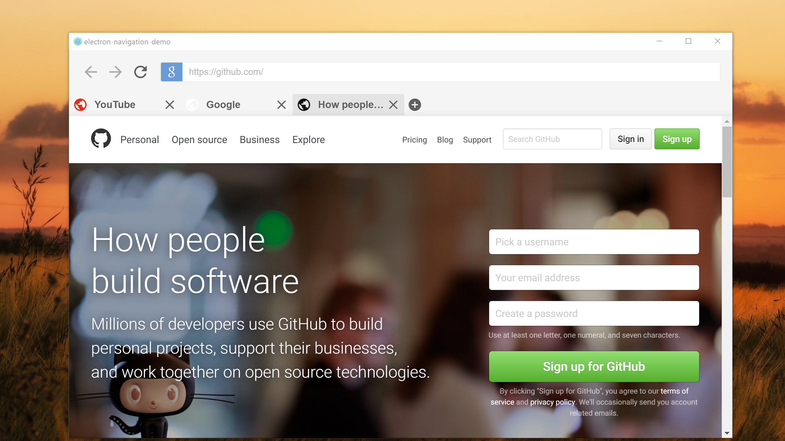
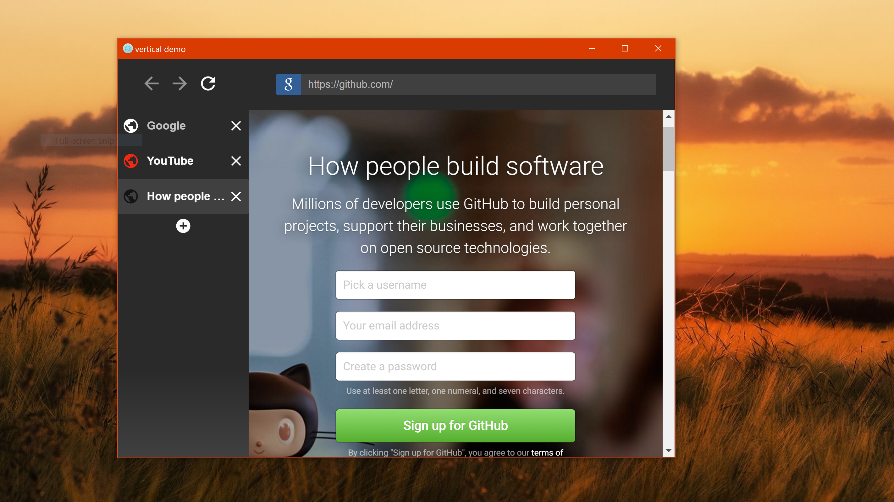
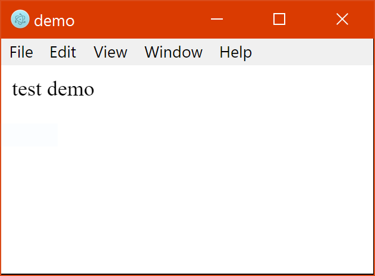
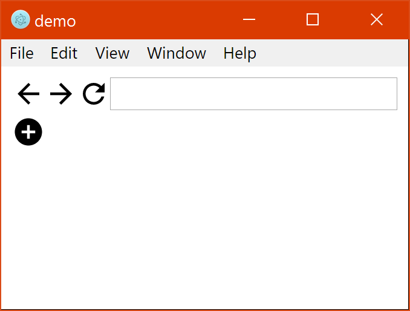

# electron-navigation
   [](https://www.paypal.me/JeremyE) [](#meta)  

Adds a navigation interface to electron that allows you to browse the internet with tabs and webviews.



### Install
---
```
npm install electron-navigation
```
> Confused? Go through the [Setup](#setup) for a full guide.   
> Know what you are doing? Skip to the [Usage](#usage) section.

### Setup
---
> This works with electron, so let's get a basic electron app going.


1. Create a folder; we'll call this one **demo**. In that folder create these three files.
    ```
    demo\package.json
    demo\index.js
    demo\index.html
    ```

2. Let's populate these files with some basic code.  

	`package.json`
    ```json
    {
      "name": "demo",
      "version": "1.0.0",
      "description": "",
      "main": "index.js",
      "scripts": {
        "test": "electron ."
      },
      "author": "",
      "license": "ISC"
    }
    ```

    `index.js`
    ```javascript
    const {
        app,
        BrowserWindow
    } = require('electron');

    let win;

    app.on('ready', () => {

        win = new BrowserWindow({
            width: 800,
            height: 600
        });

        win.loadURL('file://' + __dirname + '/index.html');

        win.on('closed', () => {
            win = null;
        });

    });
    ```
	`index.html`
    ```html
    <!DOCTYPE html>
    <html>
    	<head>

		</head>
      	<body>

			test demo
        
      	</body>
    </html>
    ```
    
3. Time to test if it works. Open up your command prompt (windows) and type these commands hitting *enter* after each one. Make sure you have Node.js installed which can be found [here](https://nodejs.org/en/download/).
    ```
    cd "C:\location\of\your\folder\demo"
    npm install electron-navigation --save
    npm test
    ```
	

4. From here on out if you leave your command prompt window open to the demo directory, you can run your app by typing.
	```
    npm test
    ```
    
### Usage
---
1. In your main **~.html** file you need to create **3** containers where the controls, tabs, and views will be auto placed into. The demo uses **index.html** as it's main file.

    `index.html`
    ```html
    <body>
    <!-- your code here -->

    <div id="nav-body-ctrls"></div>
    <div id="nav-body-tabs"></div>
    <div id="nav-body-views"></div>

    </body>
    ```
    NOTE:   
    * The **IDs** are important. Make sure they are spelled correctly.    
    * If you don't want your users to control the pages you can get rid of the controls container. The ID for that is **nav-body-ctrls** .  
    * The order or location of these divs doesn't matter, and they also don't have to be div elements one could be `<main id="nav-body-views">`.
	
2. Now we need to apply the module by adding a script tag to the **~.html** file so that it can add the tabs and controls to the containers we just created above.	

    `index.html`
    ```html
    <!-- your code here -->
	<div id="nav-body-ctrls"></div>
    <div id="nav-body-tabs"></div>
    <div id="nav-body-views"></div>
    
    <script>
        var someNameHere = require('electron-navigation');
        var anotherName = new someNameHere();
    </script>

    </body>
    ```
3. Now that we have this, let's give it a quick run. If you've been following the setup guide, it would be like this.  

    ```
    npm test
    ```
    

> This should be all you need to get the basic functionality working. Confused? Check out the [demos](https://github.com/simply-coded/electron-navigation/tree/master/test) on github, also located in your project's node-modules folder.

### Themes
---
You can apply themes by downloading the ones on [github](https://github.com/simply-coded/electron-navigation/tree/master/themes) and putting them in your `<head>` tag.  

`index.html`
```html
<head>
	<!-- your code here -->
    
	<link rel="stylesheet" href="relative/location/of/theme.css">
</head>
```
* Themes also located in `YourApp\node-modules\electron-navigation\themes\`.

The themes folder also has a template theming file that you can use to style the tabs and controls exactly how you wish. 

`theme-template.css`
```css
/* back button, grouped in: .nav-icons */

#nav-ctrls-back {
    /* fill:#000; width:24px; height:24px; */
}


/* back button with no history, grouped in: .nav-icons.disabled */

#nav-ctrls-back.disabled {
    /* pointer-events:none;	opacity:0.5; */
}
```

### Options
---
You can control how and if some elements are displayed by passing an options object through the main electron-navigation object.  

{ **showBackButton** : *boolean* }
> Shows/Hides the back button in #nav-body-ctrls. Defaults to **true**.

{ **showForwardButton** : *boolean* }
> Shows/Hides the forward button in #nav-body-ctrls. Defaults to **true**.

{ **showReloadButton** : *boolean* }
> Shows/Hides the reload button in #nav-body-ctrls. Defaults to **true**.

{ **showUrlBar** : *boolean* }
> Shows/Hides the url input in #nav-body-ctrls. Defaults to **true**.

{ **showAddTabButton** : *boolean* }
> Shows/Hides the add button in #nav-body-tabs. Defaults to **true**.

{ **closableTabs** : *boolean* }
> Shows/Hides the close button on tabs in .nav-tabs-tab. Defaults to **true**.

{ **verticalTabs** : *boolean* }
> Changes the direction tabs are stacked in #nav-body-tabs. Defaults to **false**.

```javascript
// example of all options and their default values if omitted.
options = {
	showBackButton: true,
    showForwardButton: true,
    showReloadButton: true,
    showUrlBar: true,
    showAddTabButton: true,
    closableTabs: true,
    verticalTabs: false
}
```

Example: `index.html`
```html
<script>
    var eNavigation = require('electron-navgation');

    // the order doesn't matter
    var nav = new eNavigation({
        showAddTabButton: false,
        showUrlBar: true,
        showReloadButton: false
    });
</script>
```


### Methods
---
You can control the views and tabs using the object variable you created. 

**.newTab ( url , id )**  
> **url** [*required*] - specifies the location of the webview. Will auto add an HTTP protocol if a domain is specified. Otherwise it will perform a google search.
>	```javascript
>	'http://github.com/'  = 'http://github.com/'
>	'youtube.com' = 'http://www.youtube.com/'
>	'hello there' = 'https://www.google.com/search?q=hello+there'
>	```
> **id** [*optional*] - creates an id to reference this tab later. Will console.log an error if the id is already taken or invalid.

**.changeTab ( url , id )**
> **url** [*required*] - specifies the new location of the webview. Has the same auto features as *newTab()*.  
> 
> **id** [*optional*] - changes the source of the webview with the id specified in *newTab()*. If no id is given the active tab and view are affected. Will console.log an error if the id doesn't exist.

**.closeTab( id )**
> **id** [*optional*] - closes the tab and webview with the id specified in *newTab()*. If no id is given the active tab and view are affected. Will console.log an error if the id doesn't exist.

**.back( id )**
> **id** [*optional*] - goes back on the webview with the id specified in *newTab()*. If no id is given the active tab and view are affected. Will console.log an error if the id doesn't exist.

**.forward( id )**
> **id** [*optional*] - goes forward on the webview with the id specified in *newTab()*. If no id is given the active tab and view are affected. Will console.log an error if the id doesn't exist.

**.reload( id )**
> **id** [*optional*] - reloads the webview with the id specified in *newTab()*. If no id is given the active tab and view are affected. Will console.log an error if the id doesn't exist.

**.stop( id )**
> **id** [*optional*] - stops loading the webview with the id specified in *newTab()*. If no id is given the active tab and view are affected. Will console.log an error if the id doesn't exist.

Example: `index.html`
```html
<script>    
    var eNavigation = require('electron-navigation');
	var nav = new eNavigation({ showAddTabButton: false });
	
    nav.newTab('google.com', 'srch');
    
    //setTimeout() is just used to show the effect.
    setTimeout("nav.changeTab('cool wallpapers', 'srch')", 2000);    
    setTimeout("nav.back('srch')", 5000);
    
</script>
```

### Requests | Issues | Clone
---
> Looking to add functionality to this project, report a bug, or just have a question? Submit a [request](https://github.com/simply-coded/electron-navigation/issues), or clone the app and do it yourself.

```
git clone https://github.com/simply-coded/electron-navigation.git
```

### History
---
* 1.1.1
    * `FIX` - updated the **README.md** with extra info, rearrangements, and formatting.
* 1.1.0
    * `FIX` - url bar will know not update while you are trying to type something new.
    * `ADD` - methods *back()*, *forward()*, *reload()*, and *stop()*.
    * `ADD` - optional id parameter to the above methods for selecting which view to take action on.
    * `CHANGE` - optional id paramter to *changeTab()* for selecting which view to take action on.
    * `CHANGE` - optional id parameter to *newTab()* for setting apart tabs, and controlling it later. 
    * `ADD` - option to remove the close button on tabs called *closableTabs*.
    * `ADD` - method *closeTab()* with optional id parameter for selecting which tab to take action on.
* 1.0.5
    * `ADD` - vertical demo as displayed in the previews.
* 1.0.4
	* `CHANGE` - updated demo files for developers, and added more to the **README.md**.
* 1.0.3
	* `CHANGE` - updated **README.md** with a tutorial on how to use the module.
* 1.0.2
	* `FIX` - *npm test* command for demo.
* 1.0.1
	* `CHANGE` - file names and folder structure.
* 1.0.0
	* `ADD` - initial release.

### Meta
---

Jeremy England - [simplycoded.help@gmail.com](mailto:simplycoded.help@gmail.com)

Distributed under the MIT license. See [`LICENSE`](https://spdx.org/licenses/MIT.html) for more information.
